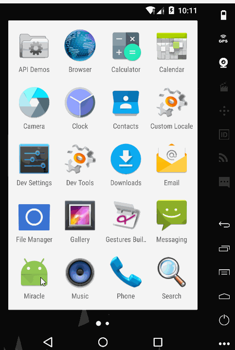

# miracleApp
miracleApp是基于React Native实现的社交类APP。目前仅适配Android端。如有问题和改进意见，欢迎提issue一起讨论学习。

## 现有功能点
1. 登录，注册，个人中心，心情，阅读，音乐，日记等界面的UI搭建
2. 引入redux，对数据进行管理
3. 引入realm，进行数据本地缓存
4. 使用axios向后台发送请求数据
5. 支持登录、注册、修改资料、发布心情，添加评论等功能，并与后台进行了联调
6. 支持播放音乐，和进度条更新

---
### 截图

---



---

## 运行

```
$ git clone https://github.com/miracle9312/miracleApp.git
$ cd miracleApp
$ npm install && react-native link
$ react-native run-android
```

## 相关第三方库

1. [axios](https://github.com/mzabriskie/axios)
2. [realm](https://realm.io/cn/)
3. [validator](https://www.npmjs.com/package/validator)
4. [redux](https://github.com/reactjs/redux)
5. [react-redux](https://github.com/reactjs/react-redux)
6. [redux-thunk](https://github.com/gaearon/redux-thunk)
7. [react-redux-form](https://github.com/davidkpiano/react-redux-formk)
8. [react-native-viewpager](https://github.com/race604/react-native-viewpager)
9. [react-native-audio-toolkit](https://github.com/futurice/react-native-audio-toolkit)
10. [react-native-fs](https://github.com/johanneslumpe/react-native-fs)
11. [react-native-slider](https://github.com/jeanregisser/react-native-slider)
12. [react-native-vector-icons](https://github.com/oblador/react-native-vector-icons)

